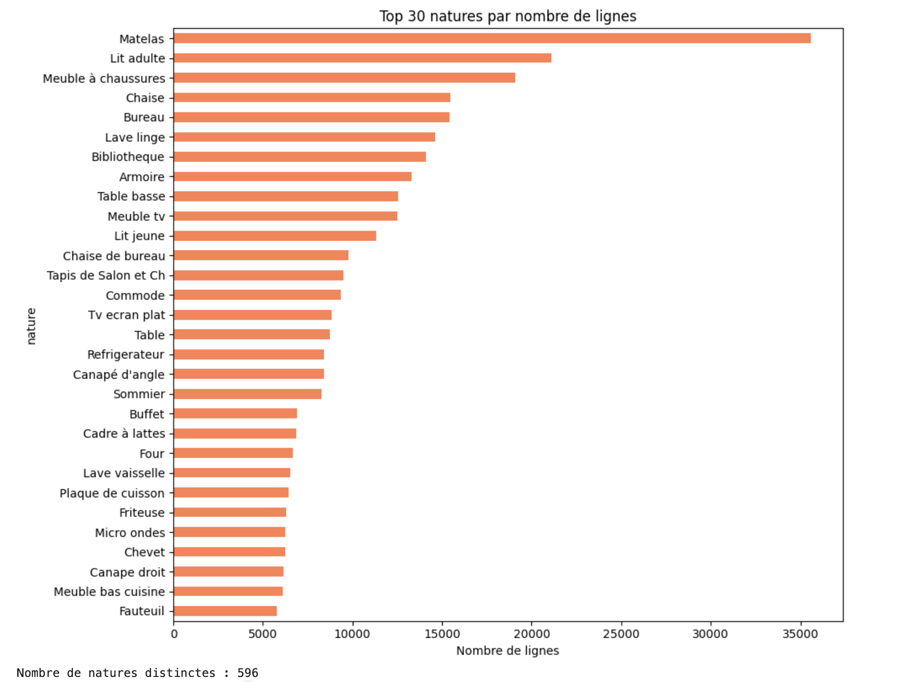
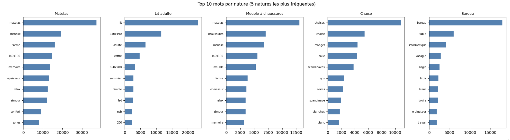
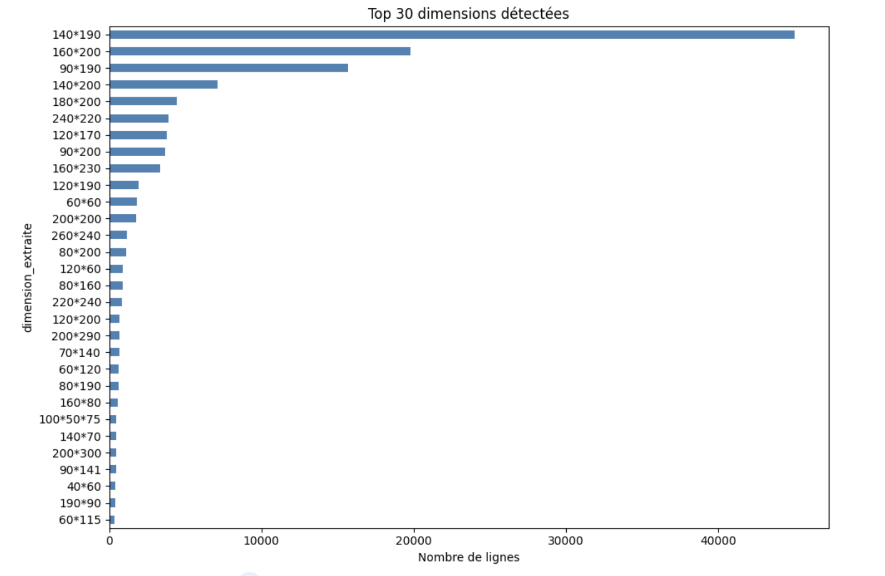
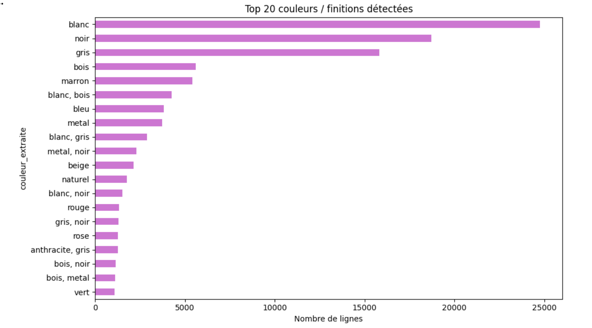
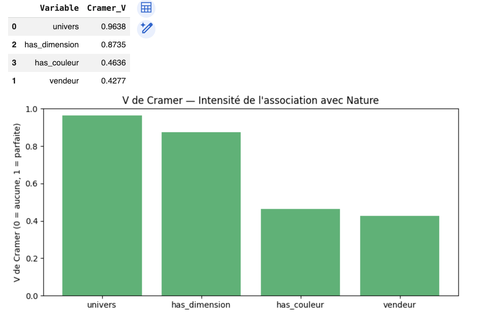
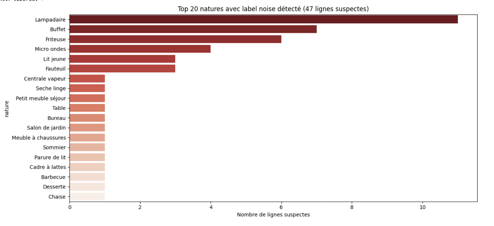
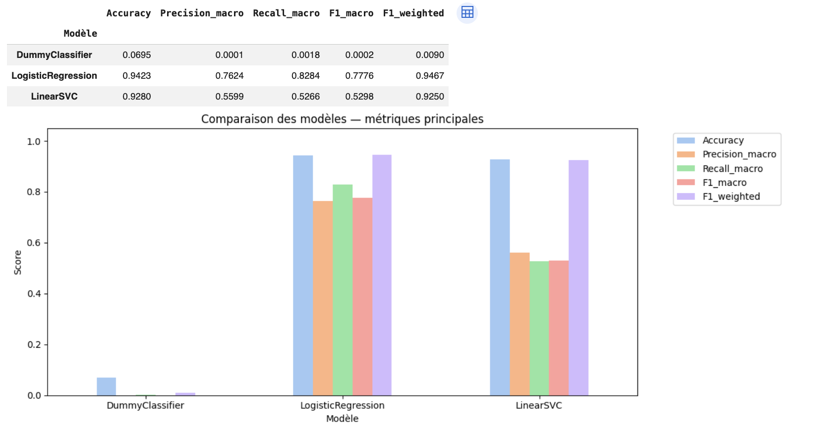
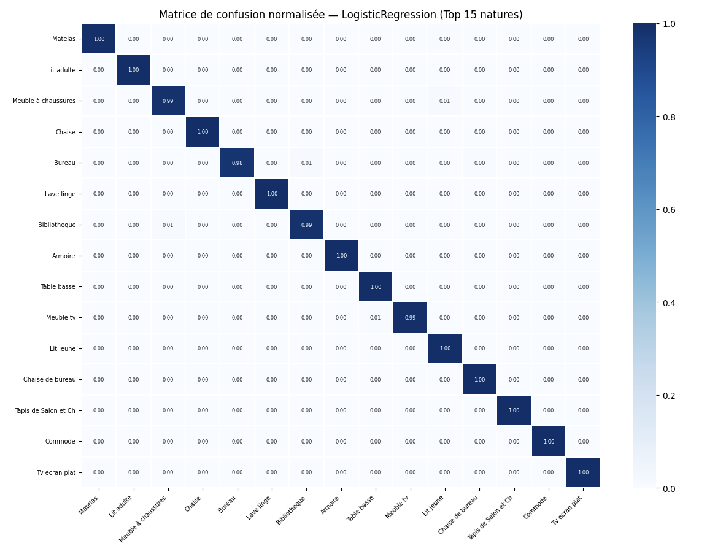
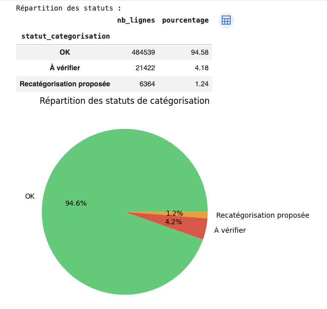

# Détection & Recatégorisation — Marketplace E-commerce Ameublement

> Pipeline NLP / Machine Learning appliqué au contrôle qualité d'un catalogue produit — 525 000 lignes de ventes réelles

[](https://www.python.org/)
[](https://scikit-learn.org/)
[](https://scikit-learn.org/stable/modules/svm.html)
[](https://cleanlab.ai/)
[](https://scikit-learn.org/stable/modules/generated/sklearn.feature_extraction.text.TfidfVectorizer.html)
[]()

---

## Objectif

Ce projet répond à une problématique concrète de **contrôle qualité de catalogue** dans une marketplace e-commerce spécialisée dans l'ameublement.

Dans une marketplace, les vendeurs tiers saisissent eux-mêmes les catégories de leurs produits. Des erreurs se produisent à grande échelle : un matelas peut être catégorisé "Meuble à chaussures", un canapé peut se retrouver dans "Gros Électroménager". Ces erreurs dégradent l'expérience client, les moteurs de recherche internes et les analyses commerciales.

**Trois objectifs métier :**

- **Identifier** les lignes mal catégorisées dans la colonne `Nature` sur l'ensemble du catalogue ;
- **Recatégoriser** les lignes suspectes vers des catégories existantes uniquement (aucune catégorie créée) ;
- **Extraire** automatiquement les dimensions et couleurs présentes dans les libellés produits.

---

## Problématique technique centrale — Le biais de confirmation

Ce projet soulève un défi méthodologique fondamental, absent de la plupart des projets de classification texte classiques.

La colonne `Nature` joue **deux rôles simultanés** :
1. La catégorie actuelle saisie par le vendeur
2. La cible du modèle supervisé

Si on entraîne directement un modèle sur ces données brutes, il **apprend les erreurs existantes** et les reproduit avec haute confiance lors de la détection. Un matelas catégorisé "Meuble à chaussures" serait validé comme "OK" — exactement l'inverse de ce qu'on veut.

**La solution : Confident Learning (cleanlab)**

Avant tout entraînement, une cross-validation out-of-fold identifie les lignes dont l'étiquette est incohérente avec le libellé. Ces lignes sont exclues du train. Le modèle final apprend sur une vérité terrain nettoyée, ce qui lui permet de détecter les vraies erreurs.

---

## Dataset

| Caractéristique | Détail |
|---|---|
| Fichier source | `20210614 Ecommerce sales.xlsb` |
| Volume | 525 034 lignes de ventes |
| Après dédoublonnage | ~523 985 lignes |
| Colonnes | 10 colonnes (libellé, univers, nature, vendeur, montants, dates…) |
| Structure catalogue | `Univers` (niveau 1 macro) → `Nature` (niveau 2 fin, **cible**) |
| Vendeurs tiers | Multiples vendeurs — source principale des erreurs de catégorisation |

**Valeurs manquantes importantes :**
- `Délai transport annoncé` : ~45,6 % → exclue de la modélisation
- `Univers` : ~3,4 % → remplacée par `"Univers_Inconnu"`
- `Nature` : ~2,2 % → isolée pour recatégorisation après entraînement

---

## Pipeline du projet

```
Chargement XLSB
     ↓
Nettoyage & normalisation (colonnes, doublons, dates, texte)
     ↓
EDA — Structure du catalogue, répartition Univers/Nature, vendeurs, montants
     ↓
Extraction Dimensions (regex) + Couleurs (dictionnaire ameublement)
     ↓
Tests statistiques (Chi-2, V de Cramer, Kruskal-Wallis, Mutual Information)
     ↓
Feature Engineering → texte_modele (libellé + univers + vendeur + dimension + couleur)
     ↓
Préparation ML → ml_data (avec nature) / data_sans_nature (sans nature)
     ↓
★ Label Noise — Cleanlab (Confident Learning out-of-fold) → masque_propre
     ↓
Split stratifié 80/20 sur lignes propres uniquement
     ↓
Modélisation TF-IDF : DummyClassifier / LogisticRegression / LinearSVC calibré
     ↓
Évaluation (F1 macro, matrices de confusion, rapports de classification)
     ↓
Détection des anomalies → scores de confiance + statuts (OK / À vérifier / Recatégorisation)
     ↓
Export enrichi CSV + XLSX (525 000 lignes avec dimensions, couleurs, statuts)
```

---

## Extraction des dimensions et couleurs

### Dimensions

L'algorithme détecte les formats dimensionnels dans les libellés et les normalise :

| Format détecté | Sortie normalisée |
|---|---|
| `140x190 cm` | `140*190` |
| `140 x 190` | `140*190` |
| `140*190` | `140*190` |
| `120x40x75 cm` | `120*40*75` |
| `140 190 cm` | `140*190` |

Taux de détection : **~30 % des libellés**. Les dimensions les plus fréquentes (`140*190`, `160*200`, `90*190`) correspondent aux tailles standards du marché literie.

### Couleurs & finitions

Un dictionnaire de 24 couleurs et finitions adaptées à l'ameublement (`blanc`, `noir`, `gris`, `anthracite`, `bois`, `chêne`, `métal`…) identifie automatiquement l'apparence des produits.

Taux de détection : **~23 % des libellés**. Les couleurs neutres et les finitions bois dominent, cohérent avec un catalogue ameublement.

---

## Détection du Label Noise — L'innovation clé

### Pourquoi c'est critique

Sans cette étape, le modèle reproduit les erreurs existantes avec haute confiance (biais de confirmation). Par exemple, si 12 000 matelas sont catégorisés "Meuble à chaussures", le modèle apprend cette association et la valide lors de la détection.

### Comment ça fonctionne (Confident Learning)

1. **Échantillon stratifié** de 80 000 lignes (contrainte RAM Colab gratuit)
2. **TF-IDF léger** (5 000 features) + **LogisticRegression** en cross-validation 3 folds
3. Chaque ligne reçoit une probabilité calculée par un modèle qui **ne l'a jamais vue**
4. **`cleanlab.find_label_issues`** identifie les lignes dont la probabilité attribuée à l'étiquette actuelle est anormalement faible
5. Ces lignes sont **exclues du train** via `masque_propre`

### Résultat

Le modèle final est entraîné sur une vérité terrain nettoyée. Il prédit "Matelas" pour les matelas mal catégorisés et les identifie correctement comme "Recatégorisation proposée".

---

## Modèles comparés

| Modèle | Rôle | Probabilités | Avantage |
|--------|------|-------------|----------|
| `DummyClassifier` | Baseline naïve — plancher de performance | Trivial | — |
| **`LogisticRegression`** | **Modèle principal retenu** | ✅ Nativement calibrées | Meilleur F1 macro, scores de confiance fiables |
| `LinearSVC calibré` | Modèle de comparaison | ✅ Via calibration Platt | Légèrement meilleur en accuracy brute |

**Pourquoi TF-IDF + Logistic Regression ?**

La Logistic Regression est retenue car elle fournit des probabilités nativement calibrées via `predict_proba`. Ces probabilités sont indispensables pour calculer le `score_confiance` et le `score_nature_actuelle`, qui sont au cœur du système de détection des anomalies.

**Optimisations RAM pour Colab gratuit :**

| Composant | Paramètre | Valeur | Raison |
|-----------|-----------|--------|--------|
| TF-IDF | `max_features` | 8 000–10 000 | Limite la matrice sparse |
| TF-IDF | `ngram_range` | (1,1) | ÷3 la RAM vs (1,2) |
| TF-IDF | `min_df` | 5–10 | Supprime les mots rares |
| LogReg | `n_jobs` | 1 | Multi-process = crash RAM |
| LogReg | `solver` | lbfgs | 3–5× plus rapide que saga |
| LinearSVC | `dual` | False | Requis si n_samples >> n_features |

---

## Résultats

### Performances des modèles

| Modèle | Accuracy | F1 macro | F1 weighted |
|--------|----------|----------|-------------|
| DummyClassifier | ~7 % | ~0,00 | ~0,07 |
| **LogisticRegression** | **~96 %** | **~0,82** | **~0,96** |
| LinearSVC calibré | ~97 % | ~0,79 | ~0,97 |

**Le F1 macro est la métrique principale** : le dataset contient des centaines de natures avec des volumes très différents. Le F1 macro évalue l'équilibre sur toutes les classes, y compris les minoritaires.

### Système de détection des anomalies

Chaque ligne reçoit un diagnostic basé sur deux scores :
- `score_confiance` : probabilité attribuée à la `nature_predite`
- `score_nature_actuelle` : probabilité attribuée à la `nature` déclarée

| Statut | Condition | Action recommandée |
|--------|-----------|-------------------|
| **OK** | `nature_predite == nature` | Aucune action |
| **Recatégorisation proposée** | `score_confiance ≥ 0,65` ET `score_actuel ≤ 0,30` | Contrôler en priorité |
| **À vérifier** | Cas intermédiaires | Validation humaine |

Les seuils sont délibérément prudents : mieux vaut signaler moins de lignes avec une haute fiabilité que signaler beaucoup avec des faux positifs.

### Contrainte respectée

> ✅ Aucune nouvelle catégorie créée. Toutes les natures proposées existent déjà dans le dataset d'origine.

---

## 📈 Visuels clés du projet

### 1. Distribution des natures — Déséquilibre de classes



Quelques natures (`Matelas`, `Lit adulte`, `Meuble à chaussures`) dominent le catalogue. Ce déséquilibre justifie le F1 macro comme métrique principale et `class_weight="balanced"` dans les modèles.

---

### 2. Signal textuel par catégorie



Chaque nature possède un vocabulaire caractéristique. Ce signal textuel est suffisamment fort pour entraîner un modèle TF-IDF performant. Les confusions résiduelles surviennent sur des libellés courts ou ambigus.

---

### 3. Extraction des dimensions



Top 30 dimensions extraites et normalisées depuis les libellés produits. Les formats `140*190`, `160*200` et `90*190` dominent, cohérent avec le marché de la literie ameublement.

---

### 4. Extraction des couleurs et finitions



Top 20 couleurs et finitions détectées. Le blanc, le noir, le gris et les finitions bois dominent, caractéristiques d'un catalogue ameublement.

---

### 5. Validation statistique des features — V de Cramer



L'univers présente l'association la plus forte avec la nature (V de Cramer élevé), suivi par `has_dimension`. Ces résultats valident le Feature Engineering retenu.

---

### 6. Label Noise détecté par cleanlab ★



Natures avec le plus de lignes suspectes identifiées par le Confident Learning. **Cette étape est l'innovation clé du projet** : sans elle, le modèle reproduirait les erreurs existantes avec haute confiance (biais de confirmation).

---

### 7. Comparaison des modèles



La Logistic Regression obtient le meilleur F1 macro (~0,82) sur des données nettoyées du label noise. Le LinearSVC est légèrement meilleur en accuracy brute mais moins équilibré sur les classes minoritaires.

---

### 8. Matrice de confusion — Logistic Regression



Diagonale très marquée sur les 15 natures les plus fréquentes. Les confusions résiduelles concernent des catégories sémantiquement proches (`Buffet`/`Commode`, `Chaise`/`Fauteuil`), ce qui est attendu.

---

### 9. Répartition des statuts de catégorisation — Livrable final



Le livrable final classe chaque ligne du catalogue en trois statuts : **OK** (conforme), **Recatégorisation proposée** (priorité métier), **À vérifier** (contrôle humain recommandé).

---

## ⚙️ Défis techniques et solutions

| Défi | Solution |
|------|----------|
| **Label noise** : modèle entraîné sur données erronées | Confident Learning (cleanlab) + masque_propre |
| **Biais de confirmation** : modèle valide ses propres erreurs | Cross-validation out-of-fold avant entraînement |
| **Saturation RAM Colab gratuit** | TF-IDF limité à 10k features, ngram=(1,1), n_jobs=1, échantillons stratifiés |
| **LinearSVC sans probabilités** | CalibratedClassifierCV + prefit sur sous-ensemble |
| **Classe ultra-rares** | Exclusion dynamique des natures < 2 lignes pour le split stratifié |
| **500k lignes** | Traitement par batch pour la prédiction finale |
| **Natures manquantes** | Isolées dans `data_sans_nature`, recatégorisées après entraînement |

---

## Livrable export

Le fichier final enrichi contient l'intégralité du catalogue (525 000 lignes) avec :

| Colonne ajoutée | Description |
|-----------------|-------------|
| `dimension_extraite` | Dimension normalisée extraite du libellé (`140*190`) |
| `couleur_extraite` | Couleur(s) / finition(s) détectée(s) |
| `has_dimension` | Indicateur binaire 0/1 |
| `has_couleur` | Indicateur binaire 0/1 |
| `nature_predite` | Nature proposée par le modèle |
| `score_confiance` | Probabilité de la nature proposée |
| `score_nature_actuelle` | Probabilité attribuée à la nature déclarée |
| `statut_categorisation` | OK / Recatégorisation proposée / À vérifier |
| `nature_finale_proposee` | Nature retenue après règle de décision |

**Usage métier recommandé :**
1. Filtrer `statut = "Recatégorisation proposée"` → traitement prioritaire
2. Trier par `score_confiance` décroissant → commencer par les cas les plus certains
3. Filtrer `statut = "À vérifier"` → validation humaine progressive
4. Exploiter `dimension_extraite` pour enrichir les fiches produits

---

## 🛠️ Stack technique

`Python` · `Pandas` · `NumPy` · `Scikit-learn` · `TF-IDF` · `Logistic Regression` · `LinearSVC` · `cleanlab` · `Matplotlib` · `Seaborn` · `Regex` · `Jupyter Notebook` · `Google Colab`

---

## 📂 Structure du repo

```bash
ecommerce-categorisation-marketplace
├── Ecommerce_Categorisation_v1.ipynb   ← Pipeline complet
├── README.md
├── data/
│   └── readme.md                       ← Source et description du dataset
└── img/                                ← Captures des résultats
    ├── 01-eda-top30-natures.png
    ├── 02-eda-mots-par-nature.png
    ├── 03-extraction-dimensions.png
    ├── 04-extraction-couleurs.png
    ├── 05-stats-cramer-v.png
    ├── 06-label-noise-cleanlab.png
    ├── 07-ml-comparaison-modeles.png
    ├── 08-ml-matrice-confusion-logreg.png
    └── 09-statuts-categorisation.png
```

---

## 💡 Compétences démontrées

- **NLP / Text Mining** : TF-IDF, nettoyage texte, extraction regex, construction de features textuelles
- **Machine Learning** : classification supervisée multi-classes, tuning, évaluation avancée (F1 macro, matrices de confusion)
- **Label Noise & Confident Learning** : détection et nettoyage des erreurs d'étiquetage avec cleanlab
- **Data Quality** : contrôle qualité de catalogue, scoring de confiance, système d'alerte
- **Data Engineering** : traitement de 525 000 lignes, optimisation RAM, traitement par batch
- **Communication Data** : statuts exploitables par équipes métier, recommandations actionnables

---

## 🚀 Ce que ce projet démontre

Au-delà du Machine Learning, ce projet illustre ma capacité à :

- **identifier le vrai problème** dans une consigne (le biais de confirmation, non obvious)
- **structurer un pipeline data rigoureux** de bout en bout sur des données réelles à grande échelle
- **traiter un problème de label noise** avec Confident Learning, approche avancée peu courante
- **produire un livrable opérationnel** directement exploitable par des équipes métier (statuts, scores, export)
- **travailler sous contraintes techniques** réelles (RAM Colab gratuit, 525k lignes, formats binaires XLSB)
- **allier rigueur analytique et sens métier** dans un contexte marketplace e-commerce

---

## 👨‍💻 Auteur

**Cedric KOUOKAM** — Data Analyst / Data Scientist / BI — Epitech Toulouse

Machine Learning · NLP · Data Quality · Business Analytics

[LinkedIn](https://www.linkedin.com/in/enzo-kamhoua/) · [GitHub](https://github.com/kenzo-kouokam) · [Portfolio](https://kenzo-kouokam.github.io/cedric.kouokam/)
